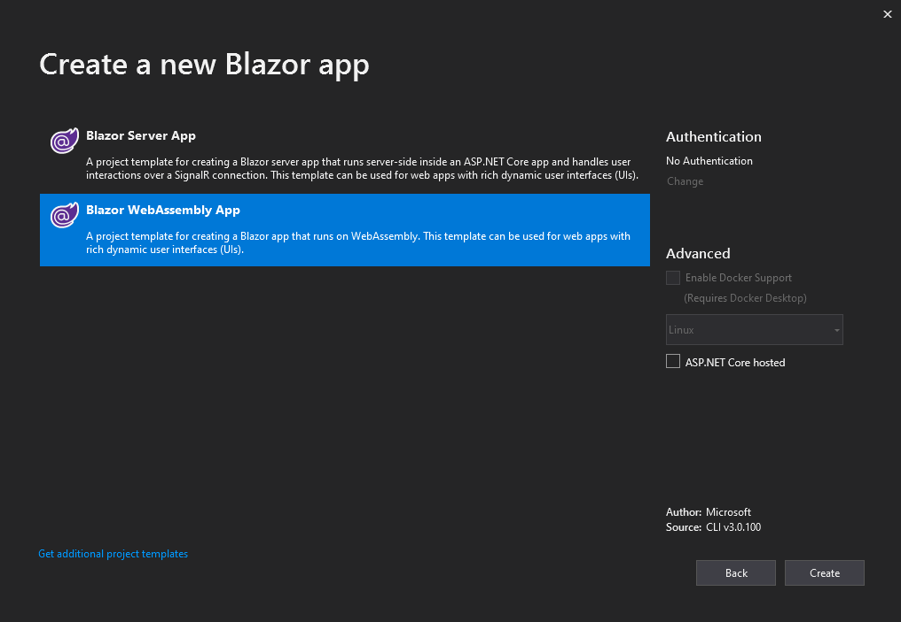
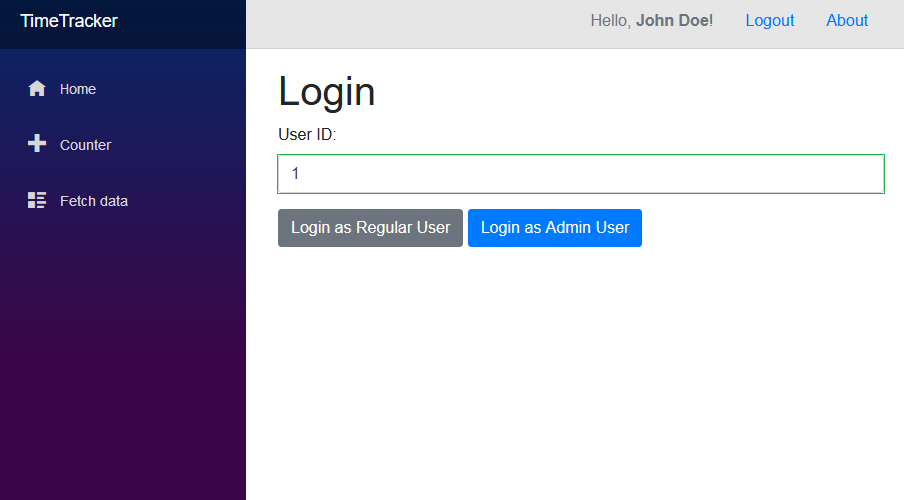
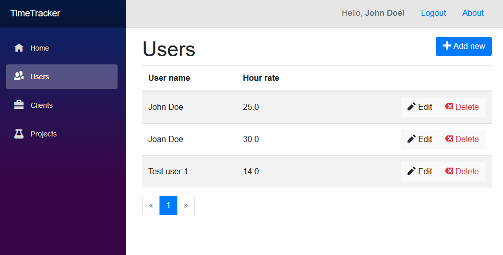
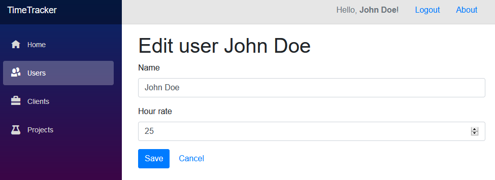
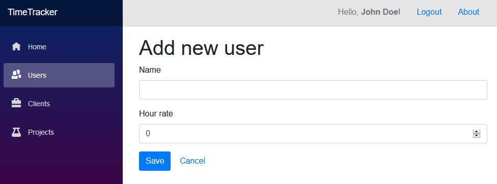

# Blazor client

[Blazor](https://dotnet.microsoft.com/apps/aspnet/web-apps/client) is a new project by Microsoft which started his life as an experiment by [Steve Sanderson](https://twitter.com/stevensanderson). It can be split into two parts - Blazor components and hosting model.

Blazor components are a new way to define encapsulated component. They can be shared between projects as NuGet packages and embedded into both ASP.NET Core server side applications as well as client side applications. Code-behind logic and event handlers are written in C#. Third-party vendors like [Telerik](https://www.telerik.com/blazor-ui), [DevExpress](https://www.devexpress.com/blazor/) and [Syncfusion](https://www.syncfusion.com/blazor-components) are already providing their own set of Blazor components.

Like mentioned above, Blazor components can be hosted on both client and server. What that means is that Blazor WebAssembly (client-side) enables running C# / .NET code in the browser. This is possible using WebAssembly standard. It means that you can write client-side web applications in .NET, without the need for JavaScript or frameworks like Aurelia, React, Vue or Angular. It's basically a replacement for them.

## Introduction to Blazor

An introduction to Blazor is done in form of PowerPoint presentation. It explains what Blazor is, has an overview of some features and the planned release dates. You can download the presentation [here](blazor-introduction.pptx).

## Creating client-side Blazor project

Add new Blazor App project to your `TimeTracker` solution, named `TimeTracker.Client`. Select *Blazor WebAssembly App* template.




You can now set your new Blazor application as a startup project. Right click on the `TimeTracker.Client` project in Solution Explorer and select *Set as StartUp project*. If you run the debugger now, a browser window will greet you with the default Blazor sample page:


## Blazor authentication

In order to access our API, we need to first get the valid JWT token. Usually, we would initiate OAuth 2.0 / OpenID Connect flow to connect to authentication server and retrieve the token. In our case, we have a simple demo service that simulates the authentication server and generates the token (not to be used in production!).

Note that the following implementation might change a lot in future versions of client-side Blazor. It's still in preview, and this is a first version, so some things require manual intervention. The process should be improved in future versions.

### Authentication infrastructure

Let's modify the Blazor client app to support authentication. The initial support for auth has been added in the preview 6 version, just on time for this workshop, so we'll use that. Most of the code that follows has been taken from excellent [NDC Oslo presentation](https://www.youtube.com/watch?v=uW-Kk7Qpv5U) by [Steve Sanderson](https://twitter.com/stevensanderson). The presentation samples can be found [on GitHub](https://github.com/SteveSandersonMS/presentation-2019-06-NDCOslo/).

To support auth, we'll need to install `Microsoft.AspNetCore.Components.Authorization` NuGet package to our `TimeTracker.Client` project. Do that now.

The first thing we need to implement is `AuthenticationStateProvider` that is capable of handling tokens in local storage. We'll add it to `Security` folder.

```c#
public class TokenAuthenticationStateProvider : AuthenticationStateProvider
{
    private readonly IJSRuntime _jsRuntime;

    public TokenAuthenticationStateProvider(IJSRuntime jsRuntime)
    {
        _jsRuntime = jsRuntime;
    }

    public override async Task<AuthenticationState> GetAuthenticationStateAsync()
    {
        var token = await GetTokenAsync();
        var user = await GetUserAsync();

        var identity = string.IsNullOrEmpty(token)
            ? new ClaimsIdentity()
            : new ClaimsIdentity(ParseClaimsFromJwt(token, user), "jwt");
        return new AuthenticationState(new ClaimsPrincipal(identity));
    }

    public async Task<string> GetTokenAsync() =>
        await _jsRuntime.InvokeAsync<string>("blazorLocalStorage.get", "authToken");

    public async Task<UserModel> GetUserAsync() =>
        await _jsRuntime.InvokeAsync<UserModel>("blazorLocalStorage.get", "user");

    public async Task SetTokenAndUserAsync(string token, UserModel user)
    {
        await _jsRuntime.InvokeAsync<object>("blazorLocalStorage.set", "authToken", token);
        await _jsRuntime.InvokeAsync<object>("blazorLocalStorage.set", "user", user);
        NotifyAuthenticationStateChanged(GetAuthenticationStateAsync());
    }

    private static IEnumerable<Claim> ParseClaimsFromJwt(string jwt, UserModel user)
    {
        var payload = jwt.Split('.')[1];
        var jsonBytes = ParseBase64WithoutPadding(payload);
        var keyValuePairs = JsonSerializer.Deserialize<Dictionary<string, object>>(jsonBytes);

        // We need this claim to fill AuthState.User.Identity.Name (to display current user name)
        keyValuePairs.Add("http://schemas.xmlsoap.org/ws/2005/05/identity/claims/name", user.Name);

        return keyValuePairs.Select(kvp => new Claim(kvp.Key, kvp.Value.ToString()));
    }

    private static byte[] ParseBase64WithoutPadding(string base64)
    {
        switch (base64.Length % 4)
        {
            case 2:
                base64 += "==";
                break;
            case 3:
                base64 += "=";
                break;
        }
        return Convert.FromBase64String(base64);
    }
}
```

We also need the user instance that we will load from our API, once we retrieve the token. Let's use the same name and same properties as in API models, and also the same folder/namespace `Models`.

```c#
public class UserModel
{
    public long Id { get; set; }
    public string Name { get; set; }
    public decimal HourRate { get; set; }
}
```

In order to use the `TokenAuthenticationStateProvider`, we need to register it in our DI container, similar as we would do it with ASP.NET Core. We're also going to create an extension method `AddTokenAuthenticationStateProvider` for `IServiceCollection` and then call it from `Startup.ConfigureServices` to avoid having too much logic in our `Startup` class.

```c#
public static class SecurityExtensions
{
    public static void AddTokenAuthenticationStateProvider(this IServiceCollection services)
    {
        // Make the same instance accessible as both AuthenticationStateProvider and TokenAuthenticationStateProvider
        services.AddScoped<TokenAuthenticationStateProvider>();
        services.AddScoped<AuthenticationStateProvider>(
            provider => provider.GetRequiredService<TokenAuthenticationStateProvider>());
    }
}
```

With this extension method implemented, we can now call it from `Startup` class. Modify `ConfigureServices` method to look like this:

```c#
public void ConfigureServices(IServiceCollection services)
{
    services.AddAuthorizationCore();
    services.AddTokenAuthenticationStateProvider();
}
```

Next step is to modify our `App.razor` file to enable cascading usage of the authentication state provider and to define information to display for non-authorized users.

```razor
<Router AppAssembly="@typeof(Program).Assembly">
    <Found Context="routeData">
        <AuthorizeRouteView RouteData="@routeData" DefaultLayout="@typeof(MainLayout)">
            <NotAuthorized>
                <h1>Access denied</h1>
                <p>Only logged-in users can access the TimeTracker client app.</p>
            </NotAuthorized>
            <Authorizing>
                Logging in...
            </Authorizing>
        </AuthorizeRouteView>
    </Found>
    <NotFound>
        <CascadingAuthenticationState>
            <LayoutView Layout="@typeof(MainLayout)">
                <h1>Page not found</h1>
                <p>Sorry, there's nothing at this address.</p>
            </LayoutView>
        </CascadingAuthenticationState>
    </NotFound>
</Router>
```

You'll get some squiggly lines in Visual Studio for the above code. To fix it, modify the main `_Imports.razor` file, to add the following lines:

```razor
@using System.Net.Http.Headers
@using Microsoft.AspNetCore.Authorization
@using Microsoft.AspNetCore.Components.Authorization
```

Our `TokenAuthenticationStateProvider` above had the call to `blazorLocalStorage` helper which we currently don't have defined. Let's fix that. Add the `wwwroot/scripts/localStorage.js` file with this content:

```js
window.blazorLocalStorage = {
  get: key => key in localStorage ? JSON.parse(localStorage[key]) : null,
  set: (key, value) => { localStorage[key] = JSON.stringify(value); }
};
```

This file needs to be included at the end of `wwwroot/index.html`:

```html
<script src="scripts/localStorage.js"></script>
```

To test how it works when users are not authenticated, let's protect some pages in our application. The protection of the pages is done more or less the same as in ASP.NET Core. By applying `[Authorize]` attribute on them. Modify `Counter.razor` and `FetchData.razor` pages by adding the attribute after the `@page` directive:

```razor
@attribute [Authorize]
```

If you try to navigate to this pages now, you'll get the *Access denied* message that we defined above in `App.razor` file.

### Adding login capability

We won't have a real login capability, but a simulated one - by calling `https://localhost:44383/get-token/` endpoint we will retrieve the JWT token and save it locally. But first, in order to make cross-origin requests (from one domain to another), we need to enable CORS on API side. We do that by adding `services.AddCors()` just before `services.AddControllers()` and `app.UseCors(...)` just before `app.UseOpenApi()` methods in `Startup` class.

```c#
// In Startup.ConfigureServices method
services.AddCors();
```

```c#
// In Startup.Configure method
// NOTE: this is just for demo purpose! Usually, you should limit access to a specific origin.
app.UseCors(
    builder => builder
        .AllowAnyOrigin()
        .AllowAnyMethod()
        .AllowAnyHeader());
```

As it says above, this is just for demo purpose. When enabling CORS, you should be more granular and allow only what's necessary. Learn more about it in [ASP.NET Core docs](https://docs.microsoft.com/en-us/aspnet/core/security/cors?view=aspnetcore-3.0).

That's it on API side. Now let's switch back to Blazor client project. We'll modify `MainLayout.razor` to include few more links, including `Login` and `Logout`. Logout is actually processed on the layout file itself, by setting both token and user to `null`. Notice how `<AuthorizeView>` works, by providing different content for authorized and non-authorized users:

```razor
@using TimeTracker.Client.Security
@inherits LayoutComponentBase
@inject TokenAuthenticationStateProvider AuthStateProvider

<div class="sidebar">
    <NavMenu />
</div>

<div class="main">
    <div class="top-row px-4 justify-content-end">
        <nav class="nav">
            <AuthorizeView>
                <Authorized>
                    <a class="nav-link disabled" href="#">
                        Hello, <strong>@context.User.Identity.Name</strong>!
                    </a>
                    <a href="javascript: void(0);" class="nav-link" @onclick="LogOut">Logout</a>
                </Authorized>
                <NotAuthorized>
                    <a href="/login" class="nav-link">Login</a>
                </NotAuthorized>
            </AuthorizeView>

            <a href="https://github.com/miroslavpopovic/aspnetcore-workshop" target="_blank" class="nav-link">About</a>
        </nav>
    </div>

    <div class="content px-4">
        @Body
    </div>
</div>

@code {
    public Task LogOut()
        => AuthStateProvider.SetTokenAndUserAsync(null, null);
}
```

Before implementing the login page, it would be good to define all the settings in one place. Blazor still doesn't have a notion of settings or a configuration that could be easily defined on server side, so let's just keep things simple and hard-code URLs in a static class that all pages can access:

```c#
public static class Config
{
    public const string ApiRootUrl = "https://localhost:44383/";
    public const string ApiResourceUrl = ApiRootUrl + "api/v2/";
    public const string TokenUrl = ApiRootUrl + "get-token";
}
```

Note: Use the correct root for your API above.

Aaaand, let's have one more ingredient before writing the login page itself. A service that will encapsulate making HTTP requests to API, using the current token. Add it under the `Services` folder/namespace.

```c#
public class ApiService
{
    private readonly HttpClient _httpClient;
    private readonly TokenAuthenticationStateProvider _authStateProvider;

    public ApiService(HttpClient httpClient, TokenAuthenticationStateProvider authStateProvider)
    {
        _httpClient = httpClient;
        _authStateProvider = authStateProvider;
    }

    public async Task<T> GetAsync<T>(string url, string token = null)
    {
        if (string.IsNullOrWhiteSpace(token))
        {
            token = await _authStateProvider.GetTokenAsync();
        }

        var request = new HttpRequestMessage(HttpMethod.Get, $"{Config.ApiResourceUrl}{url}");

        request.Headers.Authorization = new AuthenticationHeaderValue("Bearer", token);

        var response = await _httpClient.SendAsync(request);
        var responseBytes = await response.Content.ReadAsByteArrayAsync();
        return JsonSerializer.Deserialize<T>(
            responseBytes, new JsonSerializerOptions {PropertyNamingPolicy = JsonNamingPolicy.CamelCase});
    }
}
```

This service uses `HttpClient` and our `TokenAuthenticationServiceProvider` as dependencies and will implement methods for calling the API. For now, there is a generic `GetJsonApi` method that creates an HTTP GET request and returns deserialized JSON response. The token is retrieved either from `token` parameter (e.g. when calling from login page) or from `TokenAuthenticationServiceProvider.GetTokenAsync()` and used as Bearer token for the request. Root URLs are read from `Config` class.

In order to use this service as a dependency we need to register it for dependency injection. Add the following line to `Startup.ConfigureServices`:

```c#
services.AddScoped<ApiService>();
```

Finally, let's implement our `Login.razor` page. This is how it should look like:



Instead of regular username / password pair, we'll just use user ID - it's a demo app after all, and two buttons - one for getting the regular token and other for getting an admin token. Here's the implementation:

```razor
@page "/login"
@using TimeTracker.Client.Models
@using TimeTracker.Client.Security
@using TimeTracker.Client.Services
@inject HttpClient Http
@inject ApiService ApiService
@inject TokenAuthenticationStateProvider AuthStateProvider
@inject NavigationManager NavigationManager

<h1>Login</h1>

<EditForm Model="@this">
    <div class="form-group">
        <label for="userId">User ID:</label>
        <InputText id="userId" @bind-Value="userId" class="form-control" />
    </div>

    @if (!string.IsNullOrWhiteSpace(errorMessage))
    {
        <div class="alert alert-danger">
            @errorMessage
        </div>
    }

    <button type="button" class="btn btn-secondary" @onclick="LogInRegular">Login as Regular User</button>
    <button type="button" class="btn btn-primary" @onclick="LogInAdmin">Login as Admin User</button>
</EditForm>

@code {
    string errorMessage;
    string userId = string.Empty;

    public Task LogInRegular()
    {
        return LogIn(false);
    }

    public Task LogInAdmin()
    {
        return LogIn(true);
    }

    private async Task LogIn(bool admin)
    {
        var url = Config.TokenUrl;
        if (admin)
        {
            url += "?admin=true";
        }

        errorMessage = string.Empty;

        try
        {
            var token = await Http.GetStringAsync(url);
            var user = await ApiService.GetAsync<UserModel>($"users/{userId}", token);

            await AuthStateProvider.SetTokenAndUserAsync(token, user);

            NavigationManager.NavigateTo("/");
        }
        catch (Exception ex)
        {
            errorMessage = ex.Message;
        }
    }
}
```

Looks rather simple, doesn't it? We are using `<EditForm>` component which points to the page itself as a `Model`, so it can bound to page fields. `userId` is bound to the `<InputText>`. Two buttons are implemented as regular HTML `<button>` elements, but they have `onclick` handlers, pointing to page methods, defined in `@code` section (.NET code).

`LogIn` method is containing the login logic. It creates a URL and makes a call to token endpoint. The token returned is used for loading the user with the given ID. If user is successfully retrieved, both token and user instance are saved locally using `TokenAuthenticationStateProvider.SetTokenAndUserAsync()`. After that, the user is redirected to home page.

If any exception happens during token or user request, the exception message is retrieved and saved locally, and also bound to be displayed on a page as an alert.

## Adding pages

### Preparing for custom pages

While trying out the login, you might have noticed that sometimes the API call fails unexpectedly, especially if you are making successive calls. Remember that we have added usage limiting in previous part? We set it to one request per 5 seconds. Let's disable that now, as it will interfere with our testing. In API's `Startup` class comment out the following line:

```c#
//app.UseMiddleware<LimitingMiddleware>();
```

Clean up the Blazor project by removing `Counter.razor` and `FetchData.razor` pages. Modify the links in `NavMenu.razor` like this:

```razor
<ul class="nav flex-column">
    <li class="nav-item px-3">
        <NavLink class="nav-link" href="" Match="NavLinkMatch.All">
            <span class="oi oi-home" aria-hidden="true"></span> Home
        </NavLink>
    </li>
    <li class="nav-item px-3">
        <NavLink class="nav-link" href="users">
            <span class="oi oi-people" aria-hidden="true"></span> Users
        </NavLink>
    </li>
    <li class="nav-item px-3">
        <NavLink class="nav-link" href="clients">
            <span class="oi oi-briefcase" aria-hidden="true"></span> Clients
        </NavLink>
    </li>
    <li class="nav-item px-3">
        <NavLink class="nav-link" href="projects">
            <span class="oi oi-beaker" aria-hidden="true"></span> Projects
        </NavLink>
    </li>
</ul>
```

Next step, improving the `ApiService`. We need new methods for create, update and delete. Initializing request, setting up it's properties and getting the response can be refactored out from `GetAsync` into a separate `SendAuthorizedRequest` method so other methods can use it:

```c#
public async Task<T> GetAsync<T>(string url, string token = null)
{
    var response = await SendAuthorizedRequest<T>(HttpMethod.Get, url, default, token);
    var responseBytes = await response.Content.ReadAsByteArrayAsync();
    return JsonSerializer.Deserialize<T>(
        responseBytes, new JsonSerializerOptions {PropertyNamingPolicy = JsonNamingPolicy.CamelCase});
}

private async Task<HttpResponseMessage> SendAuthorizedRequest<T>(
    HttpMethod method, string url, T content = default, string token = null)
{
    if (string.IsNullOrWhiteSpace(token))
    {
        token = await _authStateProvider.GetTokenAsync();
    }

    var request = new HttpRequestMessage(method, $"{Config.ApiResourceUrl}{url}");
    request.Headers.Authorization = new AuthenticationHeaderValue("Bearer", token);

    if (content != null)
    {
        var json = JsonSerializer.Serialize<object>(
            content, new JsonSerializerOptions {PropertyNamingPolicy = JsonNamingPolicy.CamelCase});
        request.Content = new StringContent(json, Encoding.UTF8, "application/json");
    }

    return await _httpClient.SendAsync(request);
}
```

Implementing create, update and delete methods is now very simple:

```c#
public async Task<bool> CreateAsync<T>(string url, T inputModel)
{
    var response = await SendAuthorizedRequest(HttpMethod.Post, url, inputModel);
    return response.IsSuccessStatusCode;
}

public async Task<bool> UpdateAsync<T>(string url, T inputModel)
{
    var response = await SendAuthorizedRequest(HttpMethod.Put, url, inputModel);
    return response.IsSuccessStatusCode;
}

public async Task<bool> DeleteAsync(string url)
{
    var response = await SendAuthorizedRequest<object>(HttpMethod.Delete, url);
    return response.IsSuccessStatusCode;
}
```

### Adding users page

Great, now let's create `Users.razor` page that will display a list of users. The page will look like this:



Here's the implementation:

```razor
@page  "/users"
@using TimeTracker.Client.Models
@using TimeTracker.Client.Services
@attribute [Authorize]
@inject ApiService ApiService

<div class="row">
    <div class="col">
        <h1>Users</h1>
    </div>
    <div class="col text-right">
        <a href="/users/add" class="btn btn-primary"><i class="oi oi-plus"></i> Add new</a>
    </div>
</div>

@if (users == null)
{
    <div>Loading...</div>
}
else
{
    <table class="table table-striped table-hover">
        <thead>
            <tr>
                <th>User name</th>
                <th>Hour rate</th>
                <th>&nbsp;</th>
            </tr>
        </thead>
        <tbody>
            @foreach (var user in users.Items)
            {
                <tr>
                    <td>@user.Name</td>
                    <td>@user.HourRate</td>
                    <td class="text-right">
                        <div class="btn-group" role="group">
                            <a href="/users/@(user.Id)/edit" class="btn btn-light"><i class="oi oi-pencil"></i> Edit</a>
                            <a href="/users/@(user.Id)/delete" class="btn btn-light text-danger"><i class="oi oi-delete"></i> Delete</a>
                        </div>
                    </td>
                </tr>
            }
        </tbody>
    </table>

    <Pager Model="@users" Loader="@LoadUsers" />
}

@code {
    PagedList<UserModel> users;

    protected override async Task OnInitializedAsync()
    {
        await LoadUsers();
    }

    private async Task LoadUsers(int page = 1)
    {
        const int pageSize = 5;
        var url = $"users?page={page}&size={pageSize}";
        users = await ApiService.GetAsync<PagedList<UserModel>>(url);

        // State change not triggered from for loop above
        base.StateHasChanged();
    }
}
```

Few interesting things here:
- `@page "/users"` defines the URL of the page.
- We have *Add new* button in header that navigates to `/users/add` when clicked.
- To avoid errors during page loading, we have a check if `users` list is already loaded or not (displays loading message).
- The actual list of users is rendered using Bootstrap 4 table layout.
- Each user row has buttons *Edit* and *Delete* which point to appropriate pages with user ID in route - `/users/@(user.Id)/edit`.
- There's a custom `Pager` component used on a page - we'll implement that next.
- When page is loaded, `OnInitializedAsync` method is triggered - it calls `LoadUsers` method that in turn calls `ApiService` to load users from API.
- The result from `ApiService` call is saved to local `users` variable.
- At the end of load, we are calling `base.StateHasChanged()` - it's necessary because without it, handlers inside `for` loop (in Pager) won't work as expected.

The logic for navigating between pages is implemented in `Pager` component and will be used on all other pages with tables. It also serves as a sample for implementing components in Blazor.

In the `Users.razor` code above, we are giving two parameters to the `Pager` component - `Model`, which is an instance of `PagedList<T>`, and `Loader`, which is a method that runs each time a link is clicked in the `Pager` component. This method accepts one parameter - `page`, which is a current page number, and must reload the list of items. In the code above, it loads a page of items from users.

You can copy `PagedList<T>` from `TimeTracker` project models.

```c#
public class PagedList<T>
{
    public IEnumerable<T> Items { get; set; }
    public int Page { get; set; }
    public int PageSize { get; set; }
    public int TotalCount { get; set; }
    public int TotalPages => (int) Math.Ceiling((double) TotalCount / PageSize);
}
```

*Note*: to test how pager works, try setting `pageSize` to `1` in the code above or creating more users later when we implement create functionality.

### Adding `Pager` component

Here's how the `Pager` component is implemented (it goes into `Shared` folder):

```razor
@typeparam T
@using TimeTracker.Client.Models

@if (Model != null)
{
    <nav aria-label="Pager">
        <ul class="pagination">
            @if (Model.Page == 1)
            {
                <li class="page-item disabled">
                    <a class="page-link" href="javascript: void(0)" tabindex="-1">&laquo;</a>
                </li>
            }
            else
            {
                <li class="page-item">
                    <a class="page-link" href="javascript: void(0)" @onclick="(async () => await Loader(1))">&laquo;</a>
                </li>
            }
            @for (var i = 1; i <= Model.TotalPages; i++)
            {
                var pageNumber = i;
                var item = Model.Items.FirstOrDefault();

                <li class="page-item @(pageNumber == Model.Page ? "active" : "")">
                    <a class="page-link" href="javascript: void(0)" @onclick="(async () => await Loader(pageNumber))">@i</a>
                </li>
            }
            @if (Model.Page == Model.TotalPages)
            {
                <li class="page-item disabled">
                    <a class="page-link" href="javascript: void(0)" tabindex="-1">&raquo;</a>
                </li>
            }
            else
            {
                <li class="page-item">
                    <a class="page-link" href="javascript: void(0)" @onclick="(async () => await Loader(Model.TotalPages))">&raquo;</a>
                </li>
            }
        </ul>
    </nav>
}

@code {
    [Parameter] public PagedList<T> Model { get; set; }
    [Parameter] public Func<int, Task> Loader { get; set; }
}
```

Noticeable things:
- It has `@typeparam T` defined - it's necessary because `PagedList<T>` is a parameter.
- It doesn't render if attached list is not defined.
- If on first page, or on last page, the corresponding *Previous* and *Next* links will be disabled.
- Page links have a call to `Loader` parameter - they call `Loader` method and give it the page number to navigate to - pages using this component must implement `Loader` function.
- It also sets the `active` link for the current page number.

### Adding add & edit user page

That's it. Our `Users` page is now fully functional. Now on to implementing create, update and delete functionality. We will need a new input model:

```c#
public class UserInputModel
{
    [Required]
    public string Name { get; set; }

    [Range(1, 1000)]
    public decimal HourRate { get; set; }
}
```

It matches properties of the `UserInputModel` created on API side, but uses *Data Annotations* attributes for validation. Blazor supports Data Annotation out of the box, but it's also possible to use other third party validation libraries, like *Fluent Validation*. For now, we'll leave *Data Annotations*, but one point of improvement could be to move models and validation into a separate shared project, that both API and Blazor client would reference and use.





We'll implement both create and update logic on the same page, to improve code reuse:

```razor
@page "/users/{id:long}/edit"
@page "/users/add"
@using TimeTracker.Client.Models
@using TimeTracker.Client.Services
@attribute [Authorize]
@inject ApiService ApiService
@inject NavigationManager NavigationManager

@if (Id == 0)
{
    <h1>Add new user</h1>
}
else
{
    <h1>Edit user @(user == null ? string.Empty : user.Name)</h1>
}

<EditForm Model="@user" OnValidSubmit="@SaveUser">
    <DataAnnotationsValidator />
    <ValidationSummary />

    @if (!string.IsNullOrWhiteSpace(errorMessage))
    {
        <div class="alert alert-danger">@errorMessage</div>
    }

    <div class="form-group">
        <label for="name">Name</label>
        <InputText id="name" class="form-control" @bind-Value="user.Name" />
    </div>

    <div class="form-group">
        <label for="hourRate">Hour rate</label>
        <InputNumber id="hourRate" class="form-control" @bind-Value="user.HourRate" />
    </div>

    <button type="submit" class="btn btn-primary">Save</button>
    <a href="/users" class="btn btn-link">Cancel</a>
</EditForm>

@code {
    [Parameter] public long Id { get; set; }
    private UserInputModel user = new UserInputModel();
    private string errorMessage;

    protected override async Task OnInitializedAsync()
    {
        if (Id > 0)
        {
            await LoadUser();
        }
    }

    private async Task LoadUser()
    {
        var url = $"users/{Id}";
        var model = await ApiService.GetAsync<UserModel>(url);

        user = new UserInputModel
        {
            Name = model.Name,
            HourRate = model.HourRate
        };
    }

    private async Task SaveUser()
    {
        bool success;

        if (Id > 0)
        {
            success = await ApiService.UpdateAsync<UserInputModel>($"users/{Id}", user);
        }
        else
        {
            success = await ApiService.CreateAsync<UserInputModel>("users", user);
        }

        if (success)
        {
            NavigationManager.NavigateTo("/users");
        }
        else
        {
            errorMessage = "Error saving user";
        }
    }
}
```

Let's give it a closer look:
- There are two page directives - `@page "/users/{id:long}/edit"` and `@page "/users/add"` - it's perfectly valid, one is for update and one for creating new user.
- We are injecting `NavigationManager` for navigating away after successful save.
- Different heading is displayed depending on whether we are creating new user or updating an existing one.
- Main model of the page is `user` field of type `UserInputModel`.
- We are using `OnValidateSubmit` parameter of `EditForm`, so `SaveUser` method is only called if validation is successful.
- `DataAnnotationsValidator` is defined for form, to handle validation.
- `ValidationSummary` collects all the validation errors and displays a list of them.
- Any server-side API error will also be displayed here, but using Bootstrap 4 `alert` component.
- `InputText` and `InputNumber` components are bound to `user`'s properties.
- *Save* button will trigger a form submit.
- *Cancel* button will simply navigate back to the list of users.
- `LoadUser` method is called from the `OnInitializedAsync` method and uses `ApiService` to load specific user when `Id` is given (edit mode).
- `SaveUser` is triggered by valid form submission and handles both `ApiService.CreateAsync` and `ApiService.UpdateAsync`, depending on the value of `Id` parameter.
- After successful save, navigation to users list is triggered.

### Adding delete user page


`UserDelete` page is similar to `UserEdit` page:

```razor
@page "/users/{id:long}/delete"
@using TimeTracker.Client.Models
@using TimeTracker.Client.Services
@attribute [Authorize]
@inject ApiService ApiService
@inject NavigationManager NavigationManager

<h1>Delete user @(user == null ? string.Empty : user.Name)</h1>

<div class="alert alert-warning">Are you sure you want to delete this user?</div>

@if (!string.IsNullOrWhiteSpace(errorMessage))
{
    <div class="alert alert-danger">@errorMessage</div>
}

<button type="button" class="btn btn-danger" @onclick="DeleteUser">Delete</button>
<a href="/users" class="btn btn-link">Cancel</a>

@code {
    [Parameter] public long Id { get; set; }
    private UserModel user;
    private string errorMessage;

    protected override async Task OnInitializedAsync()
    {
        await LoadUser();
    }

    private async Task LoadUser()
    {
        var url = $"users/{Id}";
        user = await ApiService.GetAsync<UserModel>(url);
    }

    private async Task DeleteUser()
    {
        if (await ApiService.DeleteAsync($"users/{user.Id}"))
        {
            NavigationManager.NavigateTo("/users");
        }
        else
        {
            errorMessage = "Error saving user";
        }
    }
}
```

It is just a confirmation page for user to double check whether the user should be deleted.

That's it! All the user functionalities are implemented. It will be a good starting point for you to implement other pages now - for `Clients` and `Projects`.

### Loading lookups

All the list, edit and delete pages for `Clients` and `Projects` are similar to pages for `Users`. One difference is the `ProjectEdit` page, since it also requires a lookup list of clients, displayed as a dropdown.

To implement it, we need a hack since `InputSelect` component does not support numeric types, only strings. Steve Sanderson's [suggestion](https://github.com/aspnet/AspNetCore/issues/11181#issuecomment-506288035) to create `InputSelectNumber` also fails in our case. One of the workarounds that are working is to use a string `clientId` defined in a page itself and bind to that, instead of binding to `project.ClientId`. Here are the relevant parts from `ProjectEdit` page:

```razor
<!-- Below Name InputText box -->
<div class="form-group">
    <label for="clientId">Client</label>
    <InputSelect id="clientId" class="form-control" @bind-Value="clientId">
        <option value="">Select client...</option>
        @foreach (var client in clients)
        {
            <option value="@client.Value">@client.Name</option>
        }
    </InputSelect>
</div>

<!-- Inside @code -->
{
    [Parameter] public long Id { get; set; }
    private string clientId = string.Empty;
    private Lookup[] clients = new Lookup[] {};
    private ProjectInputModel project = new ProjectInputModel();
    private string errorMessage;

    protected override async Task OnInitializedAsync()
    {
        await LoadClients();

        if (Id > 0)
        {
            await LoadProject();
        }
    }

    private async Task LoadClients()
    {
        var clientsUrl = $"clients?page=1&size={int.MaxValue}";
        var clientsList = await ApiService.GetAsync<PagedList<ClientModel>>(clientsUrl);
        clients = clientsList.Items.Select(x => new Lookup(x.Name, x.Id.ToString())).ToArray();
    }

    private async Task LoadProject()
    {
        var url = $"projects/{Id}";
        var model = await ApiService.GetAsync<ProjectModel>(url);

        project = new ProjectInputModel
        {
            Name = model.Name,
            ClientId = model.ClientId
        };

        clientId = model.ClientId.ToString();
    }

    private async Task SaveProject()
    {
        bool success;
        project.ClientId = long.Parse(clientId);

        if (Id > 0)
        {
            success = await ApiService.UpdateAsync<ProjectInputModel>($"projects/{Id}", project);
        }
        else
        {
            success = await ApiService.CreateAsync<ProjectInputModel>("projects", project);
        }

        if (success)
        {
            NavigationManager.NavigateTo("/projects");
        }
        else
        {
            errorMessage = "Error saving project";
        }
    }
}
```

`clientId` property is set when loading the project and read when saving the project. In `SaveProject` method, it parses the given string into `long` parameter type and assigns to `project.ClientId`.

Notice how we loaded the clients and converted them to `Lookup` instances. Here's the definition of `Lookup` class. It helps with binding to `InputSelect` components.

```c#
public class Lookup
{
    public Lookup()
    {
    }

    public Lookup(string name, string value)
    {
        Name = name;
        Value = value;
    }

    public string Name { get; set; }
    public string Value { get; set; }
}
```

### Time entries pages

For time entries, we'll implement edit and delete pages only. The page with the list of time entries is not necessary. Instead, the dashboard page (home page) will contain a list of time entries for the current month and current user.

We won't spend any time on `TimeEntryDelete.razor` page, since it's the same as other delete pages.

`TimeEntryEdit.razor` is a bit more interesting. It will not have the ability to set up the user. The user that is currently logged in will be automatically set when creating new time entries, by using `AuthStateProvider.GetUserAsync()` and reading id of that user.

```c#
timeEntry = new TimeEntryInputModel
{
    UserId = (await AuthStateProvider.GetUserAsync()).Id,
    EntryDate = DateTime.Today,
    Hours = 1
};
```

Edit page will also have date entry defined using three `InputSelect` components for year, month and day. Below is a relevant part of the edit page. For the full page, check out the source code in this repository.

```razor
<div class="form-group">
    <label for="year">Date</label>
    <div class="row">
        <div class="col">
            <InputSelect id="year" class="form-control" @bind-Value="year">
                <option value="">Select year...</option>
                <option value="2019">2019</option>
                <option value="2020">2020</option>
                <option value="2021">2021</option>
                <option value="2022">2022</option>
                <option value="2023">2023</option>
                <option value="2024">2024</option>
                <option value="2025">2025</option>
                <option value="2026">2026</option>
                <option value="2027">2027</option>
                <option value="2028">2028</option>
            </InputSelect>
        </div>
        <div class="col">
            <InputSelect id="month" class="form-control" @bind-Value="month">
                <option value="">Select month...</option>
                <option value="1">January</option>
                <option value="2">February</option>
                <option value="3">March</option>
                <option value="4">April</option>
                <option value="5">May</option>
                <option value="6">June</option>
                <option value="7">July</option>
                <option value="8">August</option>
                <option value="9">September</option>
                <option value="10">October</option>
                <option value="11">November</option>
                <option value="12">December</option>
            </InputSelect>
        </div>
        <div class="col">
            <InputSelect id="day" class="form-control" @bind-Value="day">
                <option value="">Select day...</option>
                <option value="1">1st</option>
                <option value="2">2nd</option>
                <option value="3">3rd</option>
                <option value="4">4th</option>
                <option value="5">5th</option>
                <option value="6">6th</option>
                <option value="7">7th</option>
                <option value="8">8th</option>
                <option value="9">9th</option>
                <option value="10">10th</option>
                <option value="11">11th</option>
                <option value="12">12th</option>
                <option value="13">13th</option>
                <option value="14">14th</option>
                <option value="15">15th</option>
                <option value="16">16th</option>
                <option value="17">17th</option>
                <option value="18">18th</option>
                <option value="19">19th</option>
                <option value="20">20th</option>
                <option value="21">21st</option>
                <option value="22">22nd</option>
                <option value="23">23rd</option>
                <option value="24">24th</option>
                <option value="25">25th</option>
                <option value="26">26th</option>
                <option value="27">27th</option>
                <option value="28">28th</option>
                <option value="29">29th</option>
                <option value="30">30th</option>
                <option value="31">31th</option>
            </InputSelect>
        </div>
    </div>
</div>
```

Those `InputSelect` components are value bound to three fields in code:

```c#
private string year = string.Empty;
private string month = string.Empty;
private string day = string.Empty;
```

When loading the existing time entry, or creating a new one, those fields are initialized like this:

```c#
// When adding new time entry
year = DateTime.Today.Year.ToString();
month = DateTime.Today.Month.ToString();
day = DateTime.Today.Day.ToString();

// When editing existing time entry
year = model.EntryDate.Year.ToString();
month = model.EntryDate.Month.ToString();
day = model.EntryDate.Day.ToString();
```

When time entry is saved, the `TimeEntry.EntryDate` is set from those fields:

```c#
timeEntry.EntryDate =
    new DateTime(int.Parse(year), int.Parse(month), int.Parse(day));
```

### Home page dashboard

Finally, we came to the conclusion. The last page we're going to implement is a dashboard with the time entries and summary for one month. This is how it should look like:


We will modify the `Index.razor` page to look like this. The top part of the page layout will be a search form with month and year selection, plus the ability to create a new time entry.

```razor
<EditForm Model="@this" OnValidSubmit="@LoadTimeEntries">
    <div class="row">
        <div class="col text-right">
            <label for="year" class="form-control-plaintext">Month: </label>
        </div>
        <div class="col">
            <InputSelect id="year" class="form-control" @bind-Value="@year">
                <option value="2019">2019</option>
                <option value="2020">2020</option>
                <option value="2021">2021</option>
                <option value="2022">2022</option>
                <option value="2023">2023</option>
                <option value="2024">2024</option>
                <option value="2025">2025</option>
                <option value="2026">2026</option>
                <option value="2027">2027</option>
                <option value="2028">2028</option>
            </InputSelect>
        </div>
        <div class="col">
            <InputSelect id="month" class="form-control" @bind-Value="@month">
                <option value="1">January</option>
                <option value="2">February</option>
                <option value="3">March</option>
                <option value="4">April</option>
                <option value="5">May</option>
                <option value="6">June</option>
                <option value="7">July</option>
                <option value="8">August</option>
                <option value="9">September</option>
                <option value="10">October</option>
                <option value="11">November</option>
                <option value="12">December</option>
            </InputSelect>
        </div>
        <div class="col">
            <button type="submit" class="btn btn-primary">Search</button>
            <a href="/time-entries/add" class="btn btn-link">Add entry</a>
        </div>
    </div>
</EditForm>
```

It should be pretty clear how the markup above will function. Month and year selection is the same as in `TimeEntryEdit.razor`.

The central part of the page is reserved for a table of time entries and a summary below.

```razor
<table class="table table-striped table-hover">
    <thead>
        <tr>
            <th>Client name</th>
            <th>Project name</th>
            <th>Date</th>
            <th>Rate</th>
            <th>Hours</th>
            <th>Total</th>
            <th>&nbsp;</th>
        </tr>
    </thead>
    <tbody>
        @foreach (var timeEntry in timeEntries)
        {
            <tr>
                <td>@timeEntry.ClientName</td>
                <td>@timeEntry.ProjectName</td>
                <td>@timeEntry.EntryDate.ToString("yyyy-MM-dd")</td>
                <td>@timeEntry.HourRate</td>
                <td>@timeEntry.Hours</td>
                <td>@(timeEntry.HourRate * timeEntry.Hours)</td>
                <td class="text-right">
                    <div class="btn-group" role="group">
                        <a href="/time-entries/@(timeEntry.Id)/edit" class="btn btn-light"><i class="oi oi-pencil"></i> Edit</a>
                        <a href="/time-entries/@(timeEntry.Id)/delete" class="btn btn-light text-danger"><i class="oi oi-delete"></i> Delete</a>
                    </div>
                </td>
            </tr>
        }
    </tbody>
    <tfoot>
        <tr>
            <td colspan="4" class="text-right font-weight-bold">Totals: </td>
            <td class="font-weight-bold">@totalHours</td>
            <td class="font-weight-bold">@totalAmount</td>
        </tr>
    </tfoot>
</table>
```

To get the data here, we need to have another endpoint in our TimeTracker API, that will allow us to query the data per user, year and month. Let's add that now to `TimeEntriesController`.

```c#
/// <summary>
/// Gets a list of time entries for a specified user and month.
/// </summary>
/// <param name="userId">User id to get the entries for.</param>
/// <param name="year">Year of the time entry.</param>
/// <param name="month">Month of the time entry.</param>
[HttpGet("user/{userId}/{year}/{month}")]
[ProducesResponseType(StatusCodes.Status200OK, Type = typeof(TimeEntryModel[]))]
public async Task<ActionResult<TimeEntryModel[]>> GetByUserAndMonth(
    long userId, int year, int month)
{
    _logger.LogDebug(
        $"Getting all time entries for month {year}-{month} for user with id {userId}");

    var startDate = new DateTime(year, month, 1);
    var endDate = startDate.AddMonths(1);

    var timeEntries = await _dbContext.TimeEntries
        .Include(x => x.User)
        .Include(x => x.Project)
        .Include(x => x.Project.Client)
        .Where(x => x.User.Id == userId && x.EntryDate >= startDate && x.EntryDate < endDate)
        .OrderBy(x => x.EntryDate)
        .ToListAsync();

    return timeEntries
        .Select(TimeEntryModel.FromTimeEntry)
        .ToArray();
}
```

Here we are creating `startDate` and `endDate` from the given `year` and `month` parameter and use it in `Where` clause to get time entries for a single month: `x.EntryDate >= startDate && x.EntryDate < endDate`. Note: you can also add this request to your Postman collection and try it. The URL is `/api/time-entries/user/<userId>/<year>/<month>`.

Great, now we have the endpoint, so let's call it from our `Index.razor` page. The call will be made on page initialization and also each time the *Search* button is clicked. This is the `@code` part of the `Index.razor` page:

```c#
private TimeEntryModel[] timeEntries;
private string errorMessage;
private string year;
private string month;
private decimal totalAmount;
private decimal totalHours;

protected override async Task OnInitializedAsync()
{
    year = DateTime.Today.Year.ToString();
    month = DateTime.Today.Month.ToString();

    await LoadTimeEntries();
}

private async Task LoadTimeEntries()
{
    var userId = (await AuthStateProvider.GetUserAsync()).Id;
    var url = $"time-entries/user/{userId}/{int.Parse(year)}/{int.Parse(month)}";
    timeEntries = await ApiService.GetAsync<TimeEntryModel[]>(url);

    totalAmount = timeEntries.Sum(x => x.Hours * x.HourRate);
    totalHours = timeEntries.Sum(x => x.Hours);
}
```

That's it! We have reached the end of our journey. Hope you liked it!

-------

Next: [Resources and further reading](99-resources.md)
